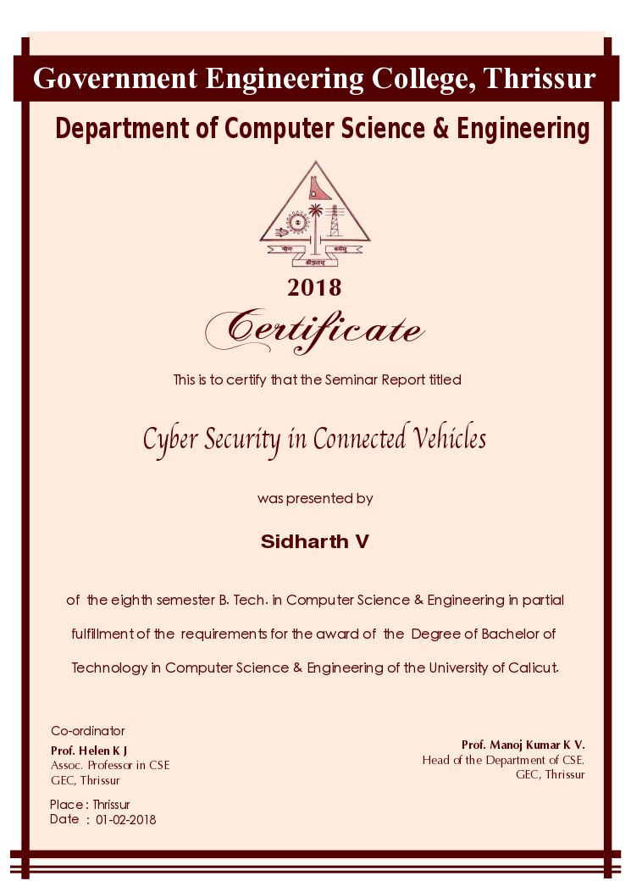

# Certificate Template

## Editor

Use [Inkscape](https://inkscape.org/en/release/) editor to edit the SVG file.

## Fonts

Title : [Apple chancery](https://www.myfonts.com/fonts/apple/chancery/)

Certificate : [Chopin Script](https://www.dafont.com/chopin-script.font)

Year : [Bitstream vera sans](https://www.fontsquirrel.com/fonts/bitstream-vera-sans)

Teachers : [Optima](https://www.myfonts.com/fonts/linotype/optima/)

