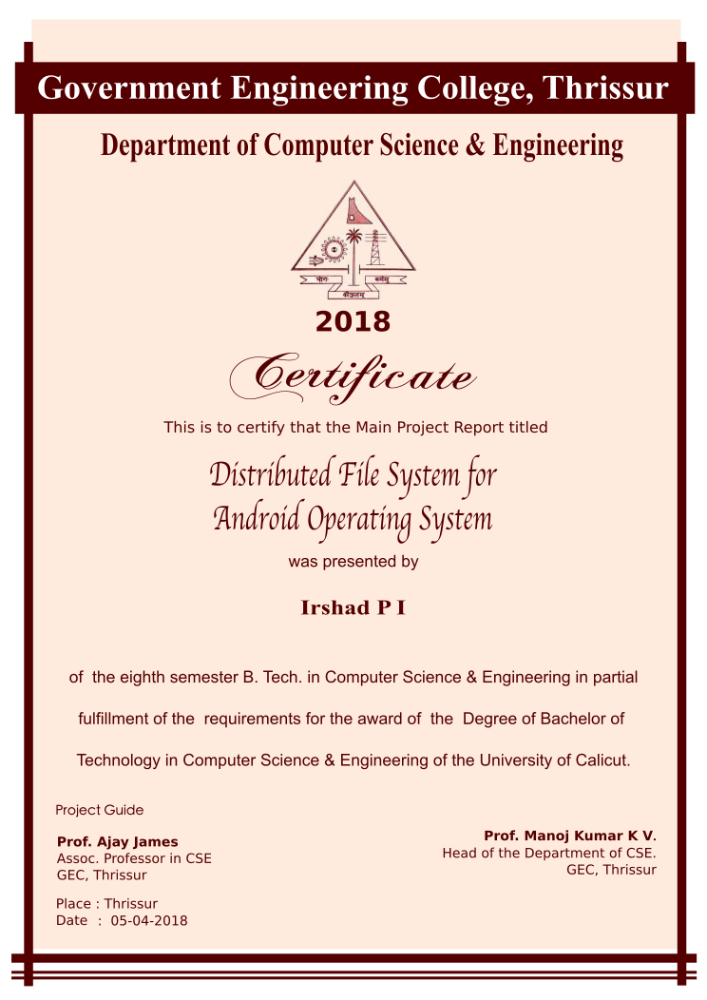

# Certificate Template

## Sample Result

## Instructions 

1. Clone or download this repository.
2. Install the fonts provided in Fonts Directory. (They are supported in Windows, Linux and Mac)
3. Make sure your system have Times New Roman and sans-serif fonts installed by default (almost all system does)
4. Download [Inkscape](https://inkscape.org/en/release/) editor (Available for Windows, Linux and Mac)
5. Open Certificate.svg, make your changes, Save as PDF.

## Credits

[Sidharth V](https://github.com/sidharthv96) for putting up the [original version for seminar report](https://github.com/sidharthv96/BTech-Certificate-Template)